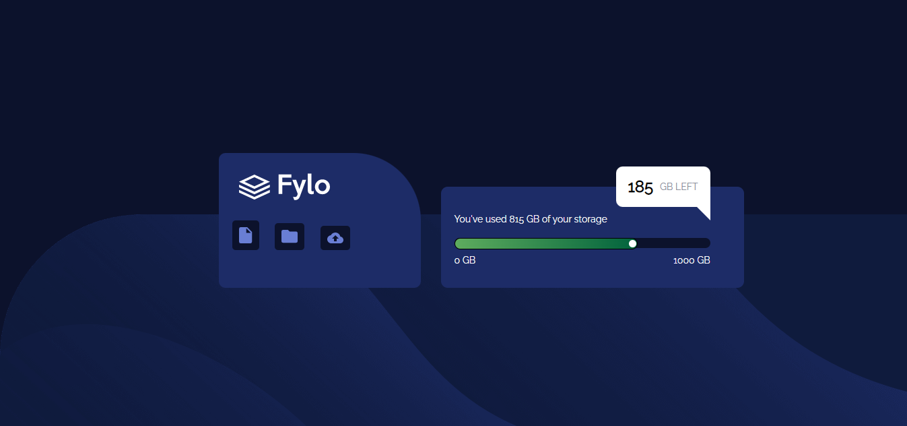

# Dados-filo

Link da página: <https://ronaldof16.github.io/Dados-filo/> 

## Sobre

Componente de armazenamento de dados filo é um desafio do [frontend mentor](https://www.frontendmentor.io/challenges/fylo-data-storage-component-1dZPRbV5n)
que serviu para aprimorar minhas habilidades em html e css, nele o propósito é deixar o design da página de acordo com o resultado do projeto.

## Aprendizado

Este desfio me fez aprimorar meus conhecimentos em html e css, principalmente em flexbox. Foi necessário muita habilidade para organizar as imagens e os 
componentes que foram criados. Aprendi a fazer um triangulo apenas com css, foi muito interessante, também achei muito legal criar aquela barra de 
carregamento com várias DIVs, uma dentro da outra, utilizei bastante as proriedades margin e padding, foi muito proveitoso, também conheci a propriedade z-index, 
que faz o elemento se sobrepor sobre outros, o que é muito útil. E também consegui fazer o modo responsivo da página, deu trabalho mas foi muito gratificante 
ver o resultado.

## Competêcias utilizadas

* HTML
* CSS

